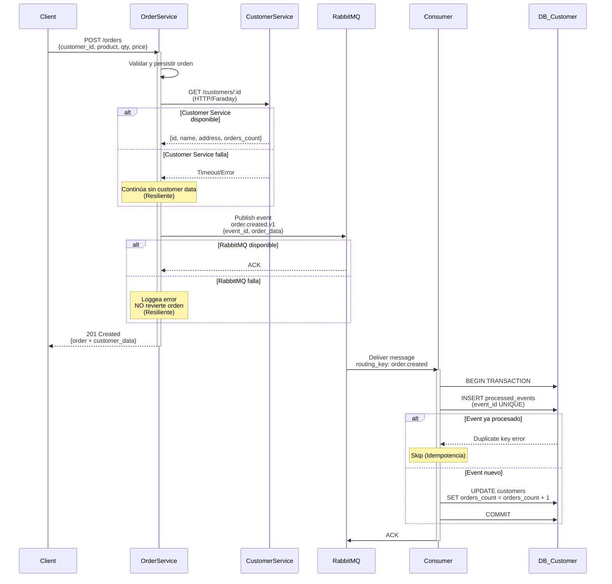

# Rails Microservices Monorepo

Arquitectura de microservicios con Rails API, comunicación HTTP síncrona, mensajería asíncrona con RabbitMQ, y bases de datos PostgreSQL independientes.

## Descripción del Proyecto

Este proyecto implementa una arquitectura de microservicios que demuestra:

- **2 Microservicios Rails API:** Order Service y Customer Service
- **Comunicación HTTP:** Llamadas síncronas entre servicios (Faraday)
- **Mensajería Asíncrona:** Eventos vía RabbitMQ (Bunny)
- **Bases de Datos Independientes:** PostgreSQL por servicio (database per service pattern)
- **Testing Completo:** RSpec con mocks de HTTP y RabbitMQ
- **Idempotencia:** Procesamiento de eventos garantizado exactly-once
- **Resiliencia:** Graceful degradation ante fallos de dependencias
- **Containerización:** Docker Compose para desarrollo y testing

### Servicios

#### Order Service (Puerto 3001)
- Crea órdenes de compra
- Enriquece respuesta con datos de Customer Service (HTTP)
- Publica eventos `order.created.v1` a RabbitMQ
- Maneja fallos de Customer Service y RabbitMQ de forma resiliente

#### Customer Service (Puerto 3002)
- Gestiona información de clientes
- Mantiene contador de órdenes (`orders_count`)
- Consume eventos de RabbitMQ para actualizar contadores
- Implementa idempotencia con tabla `processed_events`

---

## Arquitectura - Flujo de Creación de Orden



---

## Setup Local

### Requisitos Previos

- Docker y Docker Compose
- Puertos disponibles: 3001, 3002, 5672, 15672, 5433, 5434

### 1. Levantar Servicios

```bash
# Desde la raíz del monorepo
docker-compose up -d
```

Esto inicia:
- `order_service` (Rails API - Puerto 3001)
- `customer_service` (Rails API - Puerto 3002)
- `postgres_order` (PostgreSQL - Puerto 5433)
- `postgres_customer` (PostgreSQL - Puerto 5434)
- `rabbitmq` (AMQP 5672, Management UI 15672)

### 2. Setup de Bases de Datos

```bash
# Order Service
docker-compose exec order_service rails db:create
docker-compose exec order_service rails db:migrate

# Customer Service (incluye seeds con 5 clientes)
docker-compose exec customer_service rails db:create
docker-compose exec customer_service rails db:migrate
docker-compose exec customer_service rails db:seed
```

### 3. Setup de RabbitMQ

```bash
docker-compose exec customer_service rake rabbitmq:setup
```

Esto crea:
- Exchange: `order.events` (topic, durable)
- Queue: `customer_service.order_created`
- Dead Letter Exchange: `dlx.order.events`
- Dead Letter Queue: `customer_service.order_created.dlq`

### 4. Verificar Servicios

```bash
# Health checks
curl http://localhost:3001/health
curl http://localhost:3002/health

# RabbitMQ Management UI
open http://localhost:15672  # guest/guest
```

---

##  Ejecutar Consumer RabbitMQ

### Background (Recomendado para desarrollo)

```bash
docker-compose exec -d customer_service rake rabbitmq:consume
```

### Foreground (Ver logs en tiempo real)

```bash
docker-compose exec customer_service rake rabbitmq:consume
```

### Verificar que está corriendo

```bash
docker-compose exec customer_service ps aux | grep rabbitmq
```

---

##  Ejecutar Tests

### Order Service

```bash
# Todos los tests
docker-compose exec order_service bundle exec rspec

# Request specs
docker-compose exec order_service bundle exec rspec spec/requests

# Service specs
docker-compose exec order_service bundle exec rspec spec/services

# Con formato detallado
docker-compose exec order_service bundle exec rspec --format documentation
```

**Cobertura:**
- POST /orders - Creación, validaciones, HTTP mocking, RabbitMQ mocking
- GET /orders - Filtrado por customer_id
- Orders::Create service - Orquestación completa
- Events::PublishOrderCreated - Payload y publicación

### Customer Service

```bash
# Todos los tests
docker-compose exec customer_service bundle exec rspec

# Request specs
docker-compose exec customer_service bundle exec rspec spec/requests

# Consumer specs
docker-compose exec customer_service bundle exec rspec spec/consumers

# Con formato detallado
docker-compose exec customer_service bundle exec rspec --format documentation
```

**Cobertura:**
- GET /customers/:id - Respuesta con orders_count
- OrderCreatedConsumer - Procesamiento de eventos
- Idempotencia - Mismo event_id dos veces
- Error handling - Temporal vs Permanente

---

##  Smoke Test End-to-End

Ejecuta un test completo del flujo: Order Service → RabbitMQ → Customer Service

```bash
chmod +x scripts/smoke_e2e.sh
./scripts/smoke_e2e.sh
```

**Qué hace:**
1. Levanta docker-compose
2. Verifica health de servicios
3. Setup de DBs y RabbitMQ
4. Inicia consumer
5. Crea orden vía POST /orders
6. Verifica que orders_count se incrementó (con retries)

**Tiempo estimado:** 1-2 minutos

Ver documentación completa: [SMOKE_TEST.md](SMOKE_TEST.md)

---

##  Decisiones de Arquitectura (ADR)

### 1. Idempotencia con `processed_events`

**Decisión:** Tabla `processed_events(event_id UNIQUE, processed_at)` para garantizar procesamiento exactly-once.

**Contexto:** RabbitMQ puede entregar mensajes duplicados (at-least-once delivery).

**Implementación:**
```ruby
ActiveRecord::Base.transaction do
  ProcessedEvent.create!(event_id: event_id, processed_at: Time.current)
  customer.increment!(:orders_count)
end
```

**Consecuencias:**
- ✅ Garantiza idempotencia a nivel de aplicación
- ✅ Funciona incluso si RabbitMQ reentrega mensajes
- ✅ Transacción atómica: insert + update
- ⚠️ Requiere limpieza periódica de eventos antiguos (opcional)

---

### 2. Resiliencia ante Fallo de Customer Service

**Decisión:** Si Customer Service falla, Order Service **continúa** creando la orden (201 Created) con `customer: null` y warning.

**Contexto:** No queremos que la caída de un servicio bloquee operaciones críticas.

**Implementación:**
```ruby
customer_data = fetch_customer_data(customer_id)
rescue StandardError => e
  Rails.logger.warn("Failed to fetch customer: #{e.message}")
  @warnings << "Customer service unavailable. Customer data not included."
  nil
end
```

**Consecuencias:**
- ✅ Alta disponibilidad: Order Service funciona independientemente
- ✅ Eventual consistency: Customer data puede obtenerse después
- ✅ Transparencia: Warning informa al cliente del problema parcial
- ⚠️ Cliente recibe respuesta incompleta pero válida

---

### 3. Resiliencia ante Fallo de RabbitMQ

**Decisión:** Si RabbitMQ falla al publicar evento, Order Service **continúa** (201 Created) y solo loggea el error.

**Contexto:** La orden es el recurso principal; eventos son notificaciones secundarias.

**Implementación:**
```ruby
Events::PublishOrderCreated.call(order)
rescue StandardError => e
  Rails.logger.error("Failed to publish event: #{e.message}")
  # NO revierte la transacción de la orden
end
```

**Consecuencias:**
- ✅ Orden persiste aunque RabbitMQ esté caído
- ✅ No bloqueamos operaciones de negocio por infraestructura
- ✅ Podemos implementar retry/republishing después
- ⚠️ Inconsistencia temporal: orden creada pero evento no enviado
- ⚠️ Requiere mecanismo de reconciliación (opcional)

---

### 4. Routing Key y Versionado de Eventos

**Decisión:** Usar routing key `order.created` y tipo de evento `order.created.v1` para versionado.

**Contexto:** Necesitamos evolucionar el schema de eventos sin romper consumers existentes.

**Implementación:**
```ruby
{
  event_id: SecureRandom.uuid,
  occurred_at: Time.current.iso8601,
  type: 'order.created.v1',  # Versionado explícito
  order: { ... }
}
```

**Consecuencias:**
- ✅ Routing key permite filtrado por tipo de evento
- ✅ Versión en payload permite múltiples versiones coexistiendo
- ✅ Consumers pueden migrar gradualmente a nuevas versiones
- ✅ Backward compatibility: v1 consumers ignoran campos nuevos de v2
- ⚠️ Requiere documentación de schema por versión

---

### 5. Customer No Existe → Dead Letter Queue

**Decisión:** Si el customer_id del evento no existe, enviar mensaje a Dead Letter Queue (error permanente).

**Contexto:** No queremos crear customers automáticamente ni ignorar silenciosamente.

**Implementación:**
```ruby
customer = Customer.find(customer_id)
rescue ActiveRecord::RecordNotFound => e
  Rails.logger.error("Permanent error: #{e.message}")
  @channel.nack(delivery_tag, false, false)  # Sin requeue → DLQ
end
```

**Consecuencias:**
- ✅ No violamos bounded context (Customer Service es owner de Customer)
- ✅ Visibilidad del problema vía DLQ
- ✅ Permite análisis y re-procesamiento manual
- ✅ No bloquea procesamiento de otros eventos
- ⚠️ Requiere monitoreo de DLQ y alertas

---

## 📂 Estructura del Proyecto

```
rails-microservices-monorepo/
├── order_service/
│   ├── app/
│   │   ├── controllers/
│   │   │   ├── orders_controller.rb
│   │   │   └── health_controller.rb
│   │   ├── models/
│   │   │   └── order.rb
│   │   └── services/
│   │       ├── orders/
│   │       │   └── create.rb
│   │       ├── customers/
│   │       │   └── client.rb
│   │       └── events/
│   │           └── publish_order_created.rb
│   ├── spec/
│   │   ├── requests/
│   │   ├── services/
│   │   └── factories/
│   └── config/
│       └── initializers/
│           ├── faraday.rb
│           └── rabbitmq.rb
│
├── customer_service/
│   ├── app/
│   │   ├── controllers/
│   │   │   ├── customers_controller.rb
│   │   │   └── health_controller.rb
│   │   ├── models/
│   │   │   ├── customer.rb
│   │   │   └── processed_event.rb
│   │   └── consumers/
│   │       └── order_created_consumer.rb
│   ├── spec/
│   │   ├── requests/
│   │   ├── consumers/
│   │   └── factories/
│   ├── lib/tasks/
│   │   └── rabbitmq.rake
│   └── config/
│       └── initializers/
│           └── rabbitmq.rb
│
├── scripts/
│   └── smoke_e2e.sh
├── docker-compose.yml
├── DOCKER_SETUP.md
├── SMOKE_TEST.md
└── README.md
```

---

## 🔗 APIs

### Order Service (http://localhost:3001)

#### POST /orders
Crea una nueva orden.

```bash
curl -X POST http://localhost:3001/orders \
  -H "Content-Type: application/json" \
  -d '{
    "order": {
      "customer_id": 1,
      "product_name": "Laptop Dell XPS 15",
      "quantity": 2,
      "price": 1299.99
    }
  }'
```

**Respuesta (201 Created):**
```json
{
  "id": 1,
  "customer_id": 1,
  "product_name": "Laptop Dell XPS 15",
  "quantity": 2,
  "price": "1299.99",
  "status": "pending",
  "created_at": "2026-03-08T18:00:00Z",
  "updated_at": "2026-03-08T18:00:00Z",
  "customer": {
    "id": 1,
    "name": "John Doe",
    "email": "john@example.com",
    "address": "123 Main Street, New York, NY 10001, USA"
  }
}
```

#### GET /orders?customer_id=:id
Lista órdenes de un cliente.

```bash
curl http://localhost:3001/orders?customer_id=1
```

---

### Customer Service (http://localhost:3002)

#### GET /customers/:id
Obtiene información de un cliente.

```bash
curl http://localhost:3002/customers/1
```

**Respuesta (200 OK):**
```json
{
  "id": 1,
  "customer_name": "John Doe",
  "address": "123 Main Street, New York, NY 10001, USA",
  "orders_count": 5
}
```

---

## 📊 Monitoreo

### RabbitMQ Management UI

- **URL:** http://localhost:15672
- **Usuario:** guest
- **Password:** guest

**Verificar:**
- Exchange `order.events` con bindings
- Queue `customer_service.order_created` con mensajes procesados
- Dead Letter Queue `customer_service.order_created.dlq` (debe estar vacía)

### Logs

```bash
# Ver logs en tiempo real
docker-compose logs -f order_service
docker-compose logs -f customer_service
docker-compose logs -f rabbitmq

# Ver logs específicos
docker-compose logs --tail=50 customer_service
```

### Métricas Clave

```bash
# Órdenes creadas
docker-compose exec order_service rails runner "puts Order.count"

# Eventos procesados
docker-compose exec customer_service rails runner "puts ProcessedEvent.count"

# Customers con órdenes
docker-compose exec customer_service rails runner "puts Customer.where('orders_count > 0').count"
```

---

## 🛠️ Desarrollo

### Agregar Gems

```bash
# Order Service
docker-compose exec order_service bundle add gem_name
docker-compose restart order_service

# Customer Service
docker-compose exec customer_service bundle add gem_name
docker-compose restart customer_service
```

### Crear Migraciones

```bash
# Order Service
docker-compose exec order_service rails generate migration MigrationName
docker-compose exec order_service rails db:migrate

# Customer Service
docker-compose exec customer_service rails generate migration MigrationName
docker-compose exec customer_service rails db:migrate
```

### Rails Console

```bash
docker-compose exec order_service rails console
docker-compose exec customer_service rails console
```

---

## 🧹 Limpieza

```bash
# Detener servicios
docker-compose down

# Detener y eliminar volúmenes (reset completo)
docker-compose down -v

# Eliminar imágenes
docker-compose down --rmi all
```

---

## 📚 Documentación Adicional

- [DOCKER_SETUP.md](DOCKER_SETUP.md) - Guía detallada de Docker Compose
- [SMOKE_TEST.md](SMOKE_TEST.md) - Documentación del smoke test E2E
- [order_service/API_EXAMPLES.md](order_service/API_EXAMPLES.md) - Ejemplos de API de Order Service
- [customer_service/API_EXAMPLES.md](customer_service/API_EXAMPLES.md) - Ejemplos de API de Customer Service
- [customer_service/RABBITMQ_CONSUMER.md](customer_service/RABBITMQ_CONSUMER.md) - Documentación del consumer

---


##  Conceptos Demostrados

- ✅ Microservices Architecture
- ✅ Database per Service Pattern
- ✅ Event-Driven Architecture
- ✅ Synchronous HTTP Communication (Faraday)
- ✅ Asynchronous Messaging (RabbitMQ/Bunny)
- ✅ Idempotent Event Processing
- ✅ Graceful Degradation & Resilience
- ✅ Dead Letter Queue Pattern
- ✅ API-Only Rails Applications
- ✅ Service Objects Pattern
- ✅ Comprehensive Testing (RSpec)
- ✅ Docker Compose Orchestration
- ✅ End-to-End Smoke Testing
